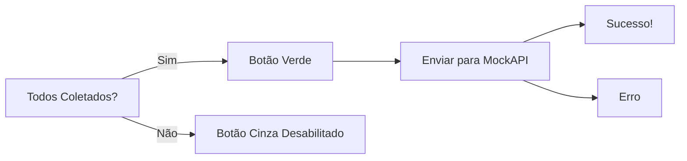
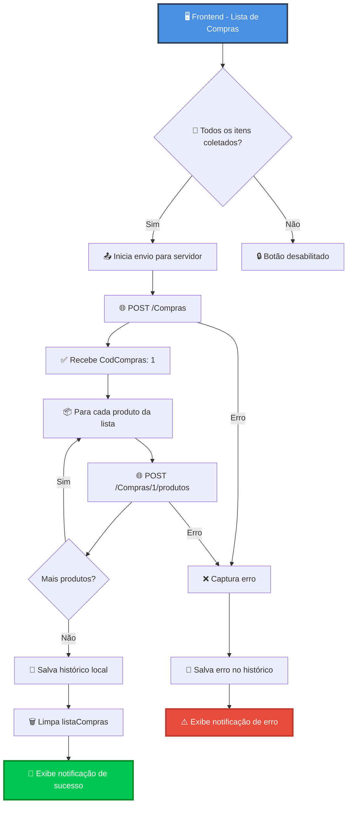

# 🛒✨ Sistema de Lista de Compras Manuscrita

<div align="center">


[](https://developer.mozilla.org/pt-BR/docs/Web/HTML)
[](https://developer.mozilla.org/pt-BR/docs/Web/CSS)
[](https://developer.mozilla.org/pt-BR/docs/Web/JavaScript)
[](https://mockapi.io)

**Uma experiência única de lista de compras que parece ter sido escrita à mão!** ✍️

[🎯 Sobre](#-sobre-o-projeto) • [✨ Funcionalidades](#-funcionalidades-principais) • [🎨 Design](#-o-design-único) • [🔌 API](#-integração-com-mockapi) • [🚀 Como Usar](#-como-usar) • [📸 Demo](#-demonstração-visual)


</div>

---

## 📖 Sobre o Projeto

> **"Transformando a simplicidade de uma lista de papel em uma aplicação web moderna"**

Este projeto nasceu como um desafio acadêmico da disciplina **Tecnologia WEB**, mas se tornou algo muito maior: uma experiência visual e funcional que une o charme das listas manuscritas com o poder da tecnologia moderna.

<details>
<summary>📚 <b>Contexto Acadêmico</b> (clique para expandir)</summary>

<br>

### 🎓 Requisitos do Trabalho

O projeto foi desenvolvido seguindo rigorosamente os requisitos acadêmicos:

| Requisito | Status | Descrição |
|-----------|--------|-----------|
| ✅ **HTML Puro** | Completo | Estrutura semântica sem frameworks |
| ✅ **CSS Puro** | Completo | Estilização avançada com animações |
| ✅ **JavaScript Vanilla** | Completo | Lógica sem bibliotecas externas |
| ✅ **CRUD Completo** | Completo | Create, Read, Update, Delete |
| ✅ **LocalStorage** | Completo | Persistência de dados |
| ✅ **Validações** | Completo | Campos obrigatórios e formatos |
| ✅ **Integração API** | Completo | MockAPI com relacionamentos |

</details>

### 🎯 O Diferencial

**Por que este projeto é especial?**
```
🎨 Design Manuscrito Único
   └─ Simula papel pautado real
   └─ Fontes que parecem escritas à mão
   └─ Animações de caneta azul

💾 Sistema de Persistência Inteligente
   └─ LocalStorage para dados locais
   └─ MockAPI para dados no servidor
   └─ Sincronização automática

🎭 Experiência do Usuário Excepcional
   └─ Notificações elegantes
   └─ Feedback visual instantâneo
   └─ Interface intuitiva
```

<div align="center">

### 🏆 Características Técnicas

| Frontend | Backend | Extras |
|:--------:|:-------:|:------:|
| 📱 Responsivo | 🔌 REST API | 🎨 Animações CSS |
| ⚡ Rápido | 📊 Relacionamentos | ✨ Fontes Custom |
| 🎯 Intuitivo | 💾 Persistência | 🎭 Modais Elegantes |

</div>

---

## ✨ Funcionalidades Principais

<table>
<tr>
<td width="50%" valign="top">

### 📦 Gerenciamento de Produtos
```javascript
// Operações disponíveis
const operacoes = {
  criar: "Cadastrar novos produtos",
  editar: "Modificar produtos existentes",
  excluir: "Remover produtos",
  listar: "Visualizar todos os produtos"
}
```

#### 🎯 Campos do Produto

- **Código**: Gerado automaticamente (incremental)
- **Nome**: Campo obrigatório, texto livre
- **Unidade**: Seleção entre 5 opções
  - `un` - Unidade
  - `kg` - Quilograma
  - `lt` - Litro
  - `mt` - Metro
  - `pc` - Pacote
- **Quantidade**: Número obrigatório, mínimo 1
- **Código de Barra**: Opcional, exatamente 13 dígitos

#### ✅ Validações Implementadas
```javascript
validacoes = {
  nome: "Campo obrigatório",
  unidade: "Seleção obrigatória",
  quantidade: "Número > 0",
  codigoBarra: "13 dígitos ou vazio"
}
```

</td>
<td width="50%" valign="top">

### 🛒 Lista de Compras Dinâmica
```javascript
// Controles disponíveis
const controles = {
  aumentar: "➕ Botão +",
  diminuir: "➖ Botão -",
  digitar: "⌨️ Input manual",
  marcar: "☑️ Auto-check"
}
```

#### 🔄 Sincronização Automática

A lista se atualiza automaticamente quando:
- ➕ Novo produto é cadastrado
- ✏️ Produto é editado
- 🗑️ Produto é excluído

#### 🎨 Feedback Visual


- **Não coletado**: Texto azul normal
- **Em progresso**: Quantidade colorida
- **Coletado**: ~~Texto riscado~~ com animação

#### 📤 Envio para Servidor


</td>
</tr>
</table>

<div align="center">

### 🎭 Sistema de Notificações

<table>
<tr>
<th>Tipo</th>
<th>Ícone</th>
<th>Quando Aparece</th>
<th>Cor</th>
</tr>
<tr>
<td>✅ Sucesso</td>
<td>✓</td>
<td>Produto salvo, Compra enviada</td>
<td>🟢 Verde</td>
</tr>
<tr>
<td>⚠️ Aviso</td>
<td>⚠️</td>
<td>Campos faltando, Validações</td>
<td>🟡 Amarelo</td>
</tr>
<tr>
<td>❌ Erro</td>
<td>❌</td>
<td>Falha na API, Erros de envio</td>
<td>🔴 Vermelho</td>
</tr>
<tr>
<td>🎊 Celebração</td>
<td>🎊</td>
<td>Compra finalizada com sucesso</td>
<td>🌈 Gradiente</td>
</tr>
</table>

</div>

---

## 🎨 O Design Único

### 🖋️ A Experiência Manuscrita

<div align="center">
```
╔══════════════════════════════════════════════════════════════╗
║  🎨 Elementos do Design Manuscrito                           ║
╠══════════════════════════════════════════════════════════════╣
║                                                              ║
║  📄 Papel Pautado Realista                                   ║
║     • Linhas azuis horizontais (como caderno real)           ║
║     • Margem vermelha vertical (estilo clássico)             ║
║     • Textura de papel envelhecido                           ║
║                                                              ║
║  ✍️ Fontes Manuscritas                                       ║
║     • Caveat: Para títulos e destaques                       ║
║     • Patrick Hand: Para textos gerais                       ║
║                                                              ║
║  🎭 Efeitos Visuais                                          ║
║     • Sombra 3D no papel                                     ║
║     • Rotação sutil (-0.5deg)                                ║
║     • Hover interativo                                       ║
║                                                              ║
╚══════════════════════════════════════════════════════════════╝
```

</div>

### 🎬 Animações e Transições

<table>
<tr>
<td width="33%">

#### 📝 Entrada de Itens
```css
@keyframes fadeIn {
  from { 
    opacity: 0;
    transform: translateX(-20px);
  }
  to { 
    opacity: 1;
    transform: translateX(0);
  }
}
```

**Efeito**: Itens deslizam suavemente da esquerda

</td>
<td width="33%">

#### ✏️ Riscado ao Coletar
```css
@keyframes strikethrough {
  to { 
    transform: translateY(-50%)
              scaleX(1);
  }
}
```

**Efeito**: Linha azul risca o texto como caneta

</td>
<td width="34%">

#### 🎪 Modal de Notificação
```css
@keyframes modalBounce {
  from {
    transform: translate(-50%, -50%)
              scale(0.8);
  }
  to {
    transform: translate(-50%, -50%)
              scale(1);
  }
}
```

**Efeito**: Modal surge com bounce effect

</td>
</tr>
</table>

### 🎨 Paleta de Cores

<div align="center">

| Elemento | Cor | Hex | Uso |
|:--------:|:---:|:---:|:---:|
| 🟦 Tinta Azul |  | `#2451a8` | Texto manuscrito |
| 🟥 Margem |  | `#ffcccb` | Margem do papel |
| 🟦 Linhas |  | `#d4e4f7` | Linhas pautadas |
| 🟨 Papel |  | `#fefcf5` | Fundo do papel |
| 🟪 Gradiente |  | `#667eea` | Botões e fundo |

</div>

### 📱 Responsividade
```css
/* Design fluido que se adapta a qualquer tela */
.container {
  width: 100%;           /* 100% do viewport */
  max-width: 800px;      /* Máximo de 800px */
  padding: 20px;         /* Espaçamento interno */
}

/* Papel se adapta mantendo proporções */
.paper {
  width: 100%;
  transform: rotate(-0.5deg);  /* Inclinação sutil */
  transition: transform 0.3s;   /* Transição suave */
}

.paper:hover {
  transform: rotate(0deg);      /* Endireita no hover */
}
```

---

## 🔌 Integração com MockAPI

### 🏗️ Arquitetura da API

<div align="center">


</div>

### 📊 Estrutura de Dados Completa

<table>
<tr>
<td width="50%">

#### 📋 Recurso: Compras
```json
{
  "CodCompras": "1",
  "data": "2025-11-26T19:42:15.276Z",
  "produtos": [
    {
      "id": "1",
      "CodProduto": 1,
      "Nome": "Arroz",
      "Unidade": "kg",
      "Quantidade": 5,
      "CodigoBarra": "7891234567890",
      "Ativo": false,
      "QuantComprada": 5
    }
  ]
}
```

**Campos Explicados:**

| Campo | Tipo | Descrição |
|-------|------|-----------|
| `CodCompras` | Object ID | ID único da compra |
| `data` | Date (ISO) | Timestamp do envio |
| `produtos` | Array | Lista de produtos comprados |

</td>
<td width="50%">

#### 📦 Recurso: produtos
```json
{
  "id": "1",
  "CodProduto": 1,
  "CompraId": "1",
  "Nome": "Arroz",
  "Unidade": "kg",
  "Quantidade": 5,
  "CodigoBarra": "7891234567890",
  "Ativo": false,
  "QuantComprada": 5
}
```

**Campos Explicados:**

| Campo | Tipo | Descrição |
|-------|------|-----------|
| `id` | Object ID | ID único do produto |
| `CodProduto` | Number | Código do sistema |
| `CompraId` | Parent ID | Vínculo com Compras |
| `Nome` | String | Nome do produto |
| `Unidade` | String | un, kg, lt, mt, pc |
| `Quantidade` | Number | Qtd necessária |
| `CodigoBarra` | String | EAN-13 (opcional) |
| `Ativo` | Boolean | false = já comprado |
| `QuantComprada` | Number | Qtd efetivamente comprada |

</td>
</tr>
</table>

### 🔄 Fluxo de Envio Detalhado

<details>
<summary>👆 <b>Clique para ver o código completo do fluxo</b></summary>
```javascript
// ========================================
// PASSO 1: Validar lista de compras
// ========================================
const lista = carregarLista(); // Busca do localStorage

if(lista.length === 0) {
  mostrarNotificacao('Lista Vazia 📝', 'Não há itens para enviar.', '⚠️');
  return;
}

const todosColetados = lista.every(item => item.coletado);
if(!todosColetados) {
  mostrarNotificacao(
    'Itens Não Coletados! ☑️',
    'Todos os itens devem estar coletados antes de enviar.',
    '⚠️'
  );
  return;
}

// ========================================
// PASSO 2: Criar registro de Compra
// ========================================
const dataCompra = new Date().toISOString();
const compra = { data: dataCompra };

const responseCompra = await fetch(
  'https://69264c8426e7e41498f9efaa.mockapi.io/Compras',
  {
    method: 'POST',
    headers: { 'Content-Type': 'application/json' },
    body: JSON.stringify(compra)
  }
);

if(!responseCompra.ok) {
  throw new Error('Erro ao criar compra no servidor');
}

const compraResult = await responseCompra.json();
const codCompra = compraResult.CodCompras; // Pega o ID gerado

// ========================================
// PASSO 3: Enviar cada produto
// ========================================
const produtos = carregarProdutos(); // Busca produtos cadastrados

for(const item of lista) {
  // Encontra o produto original para pegar o código de barras
  const produto = produtos.find(p => p.codProduto === item.codProduto);
  
  // Monta o objeto do produto
  const produtoData = {
    CodProduto: item.codProduto,
    Nome: item.nome,
    Unidade: item.unidade,
    Quantidade: item.quantidadeNecessaria,
    CodigoBarra: produto?.codigoBarra || '',
    Ativo: false,  // Marca como já comprado
    QuantComprada: item.quantidadeComprada
  };
  
  // Envia usando a URL de relacionamento
  const responseProduto = await fetch(
    `https://69264c8426e7e41498f9efaa.mockapi.io/Compras/${codCompra}/produtos`,
    {
      method: 'POST',
      headers: { 'Content-Type': 'application/json' },
      body: JSON.stringify(produtoData)
    }
  );
  
  if(!responseProduto.ok) {
    throw new Error('Erro ao enviar produto para o servidor');
  }
}

// ========================================
// PASSO 4: Salvar no histórico local
// ========================================
const hist = carregarHistorico();
hist.push({
  id: codCompra,
  data: dataCompra,
  itens: lista.length,
  sucesso: true
});
salvarHistorico(hist);

// ========================================
// PASSO 5: Limpar lista atual
// ========================================
localStorage.removeItem('listaCompras');

// ========================================
// PASSO 6: Feedback ao usuário
// ========================================
mostrarNotificacao(
  'Enviado com Sucesso! 🎊',
  `Sua compra foi enviada para o servidor!<br><br>` +
  `<em>CodCompra: ${codCompra}</em><br>` +
  `<em>Total: ${lista.length} ${lista.length === 1 ? 'item' : 'itens'}</em>`,
  '✓',
  true // Callback para recarregar lista
);
```

</details>

### 🔗 Endpoints Utilizados

<div align="center">

| Método | Endpoint | Descrição | Payload |
|:------:|:---------|:----------|:--------|
| 🟢 POST | `/Compras` | Criar nova compra | `{ data: "ISO-8601" }` |
| 🟢 POST | `/Compras/{id}/produtos` | Adicionar produto à compra | `{ CodProduto, Nome, Unidade, ... }` |
| 🔵 GET | `/Compras` | Listar todas as compras | - |
| 🔵 GET | `/Compras/{id}/produtos` | Listar produtos de uma compra | - |

</div>

### ⚠️ Tratamento de Erros
```javascript
try {
  // Tentativa de envio
  await enviarParaAPI();
  
} catch(error) {
  // Captura qualquer erro
  
  // Salva no histórico para auditoria
  const hist = carregarHistorico();
  hist.push({
    data: new Date().toISOString(),
    itens: lista.length,
    sucesso: false,
    erro: error.message  // Mensagem do erro
  });
  salvarHistorico(hist);
  
  // Exibe notificação amigável ao usuário
  mostrarNotificacao(
    'Erro ao Enviar! ❌',
    `Não foi possível enviar para o servidor.<br><br>` +
    `<em>Erro: ${error.message}</em>`,
    '❌'
  );
}
```

**Erros Comuns e Soluções:**

| Erro | Causa Provável | Solução |
|------|----------------|---------|
| `400 Bad Request` | Dados inválidos ou faltando | Verificar campos obrigatórios |
| `404 Not Found` | URL da API incorreta | Conferir configuração no código |
| `Network Error` | Sem conexão com internet | Verificar conectividade |
| `CORS Error` | Problema de permissão | MockAPI já tem CORS habilitado |

---

## 💾 Sistema de Armazenamento

### 📦 LocalStorage - Estrutura Completa

<table>
<tr>
<td width="33%">

#### 📋 listaProdutos
```json
[
  {
    "codProduto": 1,
    "nome": "Arroz",
    "unidade": "kg",
    "quantidade": 5,
    "codigoBarra": "7891234567890"
  },
  {
    "codProduto": 2,
    "nome": "Feijão",
    "unidade": "kg",
    "quantidade": 2,
    "codigoBarra": ""
  }
]
```

**Armazena:** Produtos cadastrados

**Usado em:** cadastro.js

</td>
<td width="33%">

#### 🛒 listaCompras
```json
[
  {
    "codProduto": 1,
    "nome": "Arroz",
    "unidade": "kg",
    "quantidadeNecessaria": 5,
    "quantidadeComprada": 3,
    "coletado": false
  },
  {
    "codProduto": 2,
    "nome": "Feijão",
    "unidade": "kg",
    "quantidadeNecessaria": 2,
    "quantidadeComprada": 2,
    "coletado": true
  }
]
```

**Armazena:** Lista atual de compras

**Usado em:** lista.js

</td>
<td width="34%">

#### 📜 historicoEnvios
```json
[
  {
    "id": "1",
    "data": "2025-11-26T19:42:15.276Z",
    "itens": 2,
    "sucesso": true
  },
  {
    "data": "2025-11-26T20:15:30.123Z",
    "itens": 3,
    "sucesso": false,
    "erro": "Network Error"
  }
]
```

**Armazena:** Histórico de envios

**Usado em:** lista.js

</td>
</tr>
</table>

### 🔄 Sincronização Automática

<div align="center">
```
┌──────────────────────────────────────────────────────────────┐
│                    FLUXO DE SINCRONIZAÇÃO                    │
└──────────────────────────────────────────────────────────────┘

    📦 listaProdutos                    🛒 listaCompras
         (Master)                          (Sincronizada)
            │                                    │
            │  ➕ Produto Novo Cadastrado        │
            ├────────────────────────────────────>
            │                                    │
            │                   Adiciona à lista de compras
            │                   com quantidadeComprada = 0
            │                                    │
            │  ✏️ Produto Editado                │
            ├────────────────────────────────────>
            │                                    │
            │                   Atualiza nome, unidade,
            │                   quantidadeNecessaria
            │                                    │
            │  🗑️ Produto Excluído                │
            ├────────────────────────────────────>
            │                                    │
            │                   Remove da lista de compras
            │                                    │
```

</div>

**Código da Sincronização:**
```javascript
function sincronizarListaCompras(produtos){
  let lista = carregarLista();
  
  // 1️⃣ REMOVER produtos que não existem mais
  lista = lista.filter(item => 
    produtos.some(p => p.codProduto === item.codProduto)
  );

  // 2️⃣ ADICIONAR produtos novos
  produtos.forEach(produto => {
    const existe = lista.find(item => item.codProduto === produto.codProduto);
    
    if(!existe) {
      // Produto novo - adicionar à lista
      lista.push({
        codProduto: produto.codProduto,
        nome: produto.nome,
        unidade: produto.unidade,
        quantidadeNecessaria: produto.quantidade,
        quantidadeComprada: 0,
        coletado: false
      });
    } else {
      // Produto existe - atualizar informações
      existe.nome = produto.nome;
      existe.unidade = produto.unidade;
      existe.quantidadeNecessaria = produto.quantidade;
    }
  });

  salvarLista(lista);
}
```

---

## 🏗️ Estrutura do Projeto

### 📁 Organização dos Arquivos
```
📦 lista-compras/
│
├── 📄 cadastro.html          # Página de gerenciamento de produtos
│   └── Interface para CRUD de produtos
│
├── 📄 lista.html             # Página da lista de compras
│   └── Interface para marcar itens e enviar ao servidor
│
├── 📜 cadastro.js            # Lógica do cadastro
│   ├── Validações de formulário
│   ├── Operações CRUD
│   ├── Geração de códigos automáticos
│   └── Sincronização com localStorage
│
├── 📜 lista.js               # Lógica da lista + API
│   ├── Renderização da lista
│   ├── Controle de quantidades
│   ├── Marcação de coletados
│   ├── Integração com MockAPI
│   └── Histórico de envios
│
└── 🎨 styles.css             # Estilização completa
    ├── Design manuscrito
    ├── Animações CSS
    ├── Responsividade
    └── Componentes visuais
```

### 🔍 Detalhamento dos Componentes

<details>
<summary><b>📄 cadastro.html</b> - Estrutura HTML (clique para expandir)</summary>
```html
<!DOCTYPE html>
<html lang="pt-BR">
<head>
  <meta charset="utf-8">
  <meta name="viewport" content="width=device-width,initial-scale=1">
  <title>Cadastro de Produtos</title>
  
  <!-- Fontes Manuscritas do Google Fonts -->
  <link href="https://fonts.googleapis.com/css2?family=Caveat:wght@400;600;700&family=Patrick+Hand&display=swap" rel="stylesheet">
  
  <!-- CSS Principal -->
  <link rel="stylesheet" href="styles.css">
</head>
<body>
  <div class="container">
    <!-- Papel com efeito pautado -->
    <div class="paper">
      <h1>✎ Cadastro de Produtos</h1>
      
      <!-- Formulário de cadastro -->
      <form id="formCadastro">
        <!-- Campo oculto para edição -->
        <input type="hidden" id="codProdutoEdit">
        
        <!-- Código (gerado automaticamente) -->
        <div class="form-group">
          <label class="form-label">Código do Produto</label>
          <input type="number" class="form-input" id="codProduto" 
                 disabled placeholder="Gerado automaticamente">
        </div>

        <!-- Nome do produto -->
        <div class="form-group">
          <label class="form-label">Nome do Produto *</label>
          <input type="text" class="form-input" id="nomeProduto" 
                 placeholder="Ex: Arroz, Feijão, Leite..." required>
        </div>
        
        <!-- Unidade de medida -->
        <div class="
