<!-- Hero Section -->
<div align="center">


<br><br>


<br>

**Complete shopping list management system with CRUD operations, data persistence, and REST API integration**

[🎯 About](#-about) • [✨ Features](#-features) • [🏗️ Architecture](#️-architecture) • [🚀 Getting Started](#-getting-started) • [📚 Learning](#-learning-outcomes)

</div>

---


<!-- About -->
## 🎯 **About**

<table>
<tr>
<td width="60%">

### 📋 **The Project**

A **complete shopping list management system** developed as an academic project for the Web Technology course. The system implements full CRUD operations, data persistence, and REST API integration using exclusively **HTML, CSS, and vanilla JavaScript** - no frameworks or libraries.

**Key Challenge:** Build a robust web application following industry standards while using only pure web technologies.

**Solution:** Modern JavaScript ES6+, LocalStorage for offline persistence, and RESTful API integration for data synchronization.

</td>
<td width="40%">


</td>
</tr>
</table>


<!-- Features -->
## ✨ **Features**

<div align="center">

### **Academic Requirements Compliance**

<table>
<tr>
<th>Requirement</th>
<th>Status</th>
<th>Implementation</th>
</tr>
<tr>
<td>Pure HTML/CSS/JS</td>
<td>✅ Complete</td>
<td>No frameworks or libraries used</td>
</tr>
<tr>
<td>Two pages (register & list)</td>
<td>✅ Complete</td>
<td><code>cadastro.html</code> and <code>lista.html</code></td>
</tr>
<tr>
<td>External CSS/JS files</td>
<td>✅ Complete</td>
<td><code>styles.css</code> and <code>.js</code> files</td>
</tr>
<tr>
<td>Product CRUD</td>
<td>✅ Complete</td>
<td>Create, Read, Update, Delete operations</td>
</tr>
<tr>
<td>Field validation</td>
<td>✅ Complete</td>
<td>Required fields and format validation</td>
</tr>
<tr>
<td>LocalStorage persistence</td>
<td>✅ Complete</td>
<td><code>listaProdutos</code> and <code>listaCompras</code></td>
</tr>
<tr>
<td>API integration</td>
<td>✅ Complete</td>
<td>MockAPI with Parent-Child relationships</td>
</tr>
<tr>
<td>Server submission</td>
<td>✅ Complete</td>
<td>POST with all collected items</td>
</tr>
</table>

</div>

### 🎯 **Core Functionality**

<table>
<tr>
<td width="50%">

#### **Product Management**
- 📝 **Create**: Add new products to catalog
- 📋 **Read**: View all registered products
- ✏️ **Update**: Edit product information
- 🗑️ **Delete**: Remove products from system
- 🔍 **Validation**: Automatic field validation
- 🔢 **Auto-ID**: Automatic code generation

</td>
<td width="50%">

#### **Shopping List**
- 🛒 **Sync**: Auto-sync with product catalog
- ➕ **Quantity Control**: Increase/decrease items
- ✅ **Auto-complete**: Mark as collected automatically
- 📊 **Progress Tracking**: Visual completion status
- 🔄 **Real-time Updates**: Instant UI feedback
- 📤 **Server Sync**: Send completed list to API

</td>
</tr>
</table>


<!-- Architecture -->
## 🏗️ **Architecture**

<div align="center">

### **System Flow**

```mermaid
graph LR
    A[📝 Product Register] -->|Save| B[💾 LocalStorage]
    B -->|Sync| C[🛒 Shopping List]
    C -->|Collect Items| D[✅ Complete]
    D -->|Send| E[🌐 REST API]
    E -->|Response| F[📊 History]
    
    style A fill:#4169E1,stroke:#1E3A8A,color:#fff
    style B fill:#10B981,stroke:#059669,color:#fff
    style C fill:#F59E0B,stroke:#D97706,color:#fff
    style D fill:#8B5CF6,stroke:#6D28D9,color:#fff
    style E fill:#EF4444,stroke:#DC2626,color:#fff
    style F fill:#6366F1,stroke:#4F46E5,color:#fff
```



</div>

### 📁 **Project Structure**

```
📦 shopping-list-system/
 ┃
 ┣ 📄 cadastro.html          ← Product management page
 ┣ 📄 lista.html             ← Shopping list page
 ┃
 ┣ 📜 cadastro.js            ← CRUD logic & validations
 ┣ 📜 lista.js               ← Shopping control & API integration
 ┃
 ┗ 🎨 styles.css             ← Complete styling
```

### 💾 **Data Architecture**

<div align="center">

```
┌─────────────────────────────────────────────┐
│           LocalStorage Layer                │
├─────────────────────────────────────────────┤
│  listaProdutos    │  Product Catalog        │
│  listaCompras     │  Shopping List          │
│  historicoEnvios  │  Submission History     │
└─────────────────────────────────────────────┘
                    │
                    ▼
┌─────────────────────────────────────────────┐
│              REST API Layer                 │
├─────────────────────────────────────────────┤
│  /Compras              │  Shopping records  │
│  /Compras/{id}/produtos│  Product items     │
└─────────────────────────────────────────────┘
```

</div>


<!-- Technologies -->
## 🛠️ **Technologies**

<div align="center">

### **Pure Web Stack**

<table>
<tr>
<td align="center" width="33%">

### 📝 **Frontend**


**HTML5 Semantic**  
**CSS3 Modern**  
**JavaScript ES6+**

</td>
<td align="center" width="33%">

### 💾 **Storage**


**LocalStorage API**  
Client-side persistence  
JSON data format

</td>
<td align="center" width="33%">

### 🔌 **Integration**


**Fetch API**  
REST architecture  
MockAPI service

</td>
</tr>
</table>

### ⚡ **JavaScript Features**


</div>


<!-- Key Features -->
## 🎯 **Key Features Breakdown**

<div align="center">

### **Smart Automation**

</div>

<table>
<tr>
<td width="50%">

### 🔢 **Auto ID Generation**

- **Sequential numbering**: 1, 2, 3...
- **No duplicates**: Guaranteed unique IDs
- **Gap handling**: Works after deletions
- **Auto-increment**: Always next available

</td>
<td width="50%">

### 🔄 **Auto Synchronization**

- **Real-time sync**: Product ↔ Shopping list
- **Add detection**: New products auto-added
- **Update propagation**: Changes reflected instantly
- **Delete cleanup**: Removed items cleared

</td>
</tr>
<tr>
<td width="50%">

### ✅ **Smart Collection**

- **Auto-mark**: Completes when quantity reached
- **Visual feedback**: Strikethrough completed items
- **Progress tracking**: Real-time completion status
- **Button control**: Enable submit when all collected

</td>
<td width="50%">

### 🔌 **API Integration**

- **REST architecture**: Parent-Child relationships
- **Batch submission**: All items in one transaction
- **Error handling**: Graceful failure management
- **History tracking**: Complete submission log

</td>
</tr>
</table>

### 📊 **Data Management**

<div align="center">

| Feature | Description | Benefit |
|---------|-------------|---------|
| **LocalStorage** | Client-side persistence | Offline functionality |
| **JSON Format** | Structured data storage | Easy manipulation |
| **Validation** | Input verification | Data integrity |
| **Barcode Support** | EAN-13 format | Product identification |
| **Unit System** | Multiple units (kg, lt, un) | Flexible measurement |

</div>


<!-- Getting Started -->
## 🚀 **Getting Started**

<div align="center">

### **Quick Setup**

</div>

### 📋 **Prerequisites**

- 🌐 Modern web browser (Chrome, Firefox, Safari, Edge)
- 📝 Text editor (optional, for code viewing)
- 🔌 Internet connection (for API features)

### ⚡ **Installation**

<table>
<tr>
<td width="50%" align="center">

### 1️⃣ **Clone Repository**

```bash
git clone https://github.com/
joaogalimberti/
shopping-list-system.git

cd shopping-list-system
```


</td>
<td width="50%" align="center">

### 2️⃣ **Open in Browser**

```bash
# Direct file opening
open cadastro.html

# Or use local server
python -m http.server 8000
```


</td>
</tr>
</table>

### 🎮 **Usage Flow**

<div align="center">

```
1️⃣ Open cadastro.html
         ↓
2️⃣ Register products (name, unit, quantity, barcode)
         ↓
3️⃣ Open lista.html
         ↓
4️⃣ Increase quantities as you shop
         ↓
5️⃣ Items auto-mark as collected
         ↓
6️⃣ Submit to server when complete
```

</div>


<!-- Learning Outcomes -->
## 📚 **Learning Outcomes**

<div align="center">

### **Academic Skills Development**

</div>

<table>
<tr>
<td width="50%">

### 💻 **Technical Skills**

- ✅ **JavaScript ES6+**: Modern syntax and features
- ✅ **DOM Manipulation**: Dynamic content updates
- ✅ **Event Handling**: User interaction management
- ✅ **AJAX/Fetch**: Asynchronous HTTP requests
- ✅ **LocalStorage**: Client-side data persistence
- ✅ **REST APIs**: HTTP methods and integration
- ✅ **JSON**: Data format and parsing
- ✅ **Form Validation**: Input verification

</td>
<td width="50%">

### 🧠 **Programming Concepts**

- ✅ **CRUD Operations**: Create, Read, Update, Delete
- ✅ **Data Structures**: Arrays, Objects, JSON
- ✅ **Async Programming**: Promises, async/await
- ✅ **Error Handling**: Try-catch blocks
- ✅ **Code Organization**: Modular functions
- ✅ **State Management**: Application state control
- ✅ **API Integration**: Client-server communication
- ✅ **Design Patterns**: Best practices implementation

</td>
</tr>
</table>

### 🎯 **Applied Concepts**

<div align="center">

| Concept | Implementation | Learning Value |
|---------|----------------|----------------|
| **MVC Pattern** | Separation of concerns | Code organization |
| **RESTful APIs** | HTTP methods (GET, POST) | Client-server architecture |
| **AJAX** | Fetch API | Asynchronous communication |
| **Persistence** | LocalStorage | Data management |
| **Validation** | Form validation | Data integrity |
| **Responsive Design** | CSS3 | Modern UI/UX |

</div>


<!-- Academic Context -->
## 🎓 **Academic Context**

<div align="center">

### **Web Technology Course Project**

</div>

<table>
<tr>
<td width="50%">

### 📚 **Course Information**

**Program:** Systems Analysis and Development  
**Course:** Web Technology  
**Institution:** UCL University  
**Year:** 2024

**Objective:** Develop a complete web application using only vanilla web technologies (HTML, CSS, JavaScript)

</td>
<td width="50%">

### 🎯 **Project Goals**

- Implement CRUD operations
- Practice DOM manipulation
- Learn API integration
- Apply data persistence
- Follow web standards
- Write clean, maintainable code

</td>
</tr>
</table>

### 🏆 **Project Achievements**

<div align="center">


</div>


<!-- Features Demo -->
## 🎬 **Features Overview**

<div align="center">

### **System Capabilities**

</div>

### 📝 **Product Management Page**

<table>
<tr>
<td width="50%">

#### **Registration Form**
- Product name (required)
- Unit selection (kg, lt, un, mt, pc)
- Quantity (positive numbers)
- Barcode (EAN-13, optional)
- Auto-generated product code

</td>
<td width="50%">

#### **Product List**
- View all registered products
- Edit product information
- Delete products
- Real-time updates
- Sorted by product code

</td>
</tr>
</table>

### 🛒 **Shopping List Page**

<table>
<tr>
<td width="50%">

#### **Interactive List**
- Synced with product catalog
- Quantity controls (+/-)
- Manual quantity input
- Visual completion indicators
- Strikethrough completed items

</td>
<td width="50%">

#### **Submission System**
- Collect all items requirement
- Submit to REST API
- Automatic history logging
- Success/error notifications
- Clear after submission

</td>
</tr>
</table>


<!-- Contributing -->
## 🤝 **Contributing**

<div align="center">

**Contributions and suggestions are welcome!**

</div>

```bash
# 1. Fork the repository
# 2. Create your feature branch
git checkout -b feature/NewFeature

# 3. Commit your changes
git commit -m 'feat: Add NewFeature'

# 4. Push to the branch
git push origin feature/NewFeature

# 5. Open a Pull Request
```

### 💡 **Improvement Ideas**

- 📱 Mobile app version
- 🔍 Search and filter functionality
- 📊 Shopping statistics
- 🏪 Store location integration
- 💰 Price tracking
- 🔔 Low stock notifications


<!-- Contact -->
## 📬 **Contact**

<div align="center">

### **Let's Connect!**

[](mailto:joaogalimberti@gmail.com)
[](https://www.linkedin.com/in/joaogalimberti/)
[](https://github.com/joaogalimberti)

</div>

---

<div align="center">


**Developed with 💙 by [João Galimberti](https://github.com/joaogalimberti) | UCL University | 2025**

*Academic project demonstrating modern web development fundamentals*

</div>
